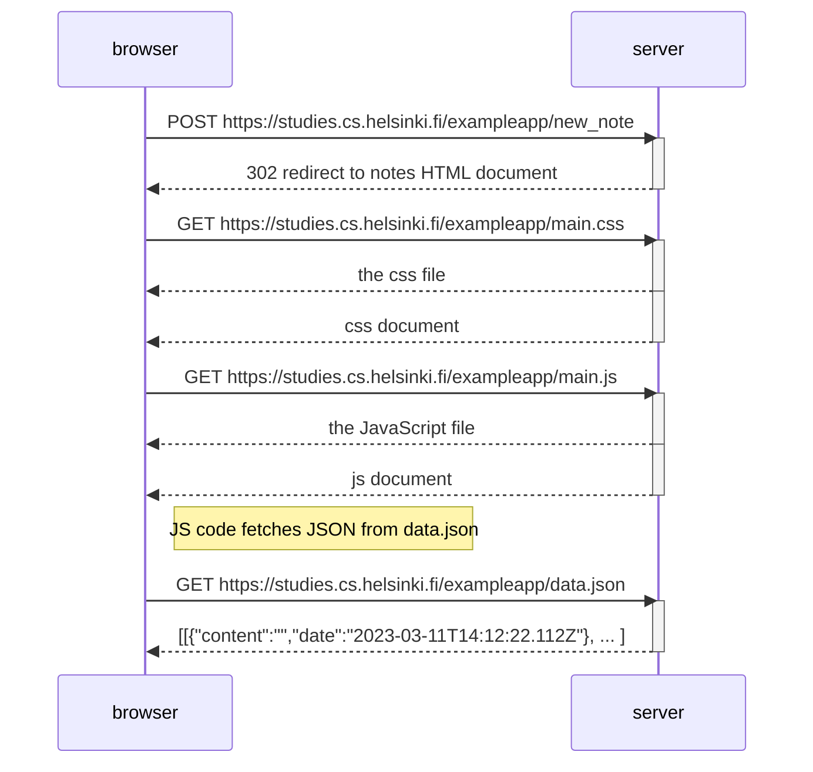

```mermaid
sequenceDiagram
    participant browser
    participant server
    browser->> server: POST https://studies.cs.helsinki.fi/exampleapp/new_note
    activate server
    server-->>browser: 302 redirect to notes HTML document
    deactivate server

    browser->>server: GET https://studies.cs.helsinki.fi/exampleapp/main.css
    activate server
    server-->>browser: the css file
    deactivate server

    activate server
    server-->>browser: css document
    deactivate server

    browser->>server: GET https://studies.cs.helsinki.fi/exampleapp/main.js
    activate server
    server-->>browser: the JavaScript file
    deactivate server

    activate server
    server-->>browser: js document
    deactivate server

    Note right of browser: JS code fetches JSON from data.json

     browser->>server: GET https://studies.cs.helsinki.fi/exampleapp/data.json
    activate server
    server-->>browser: [[{"content":"","date":"2023-03-11T14:12:22.112Z"}, ... ]
    deactivate server


```
