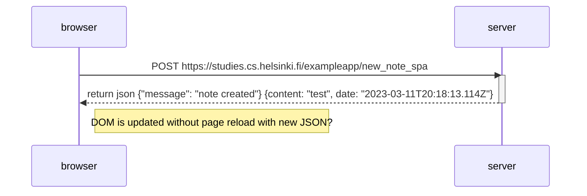

```mermaid
sequenceDiagram
    participant browser
    participant server

    browser->> server: POST https://studies.cs.helsinki.fi/exampleapp/new_note_spa

    activate server
    server-->>browser: return json {"message": "note created"} {content: "test", date: "2023-03-11T20:18:13.114Z"}
    deactivate server

    Note right of browser: DOM is updated without page reload with new JSON?

```
