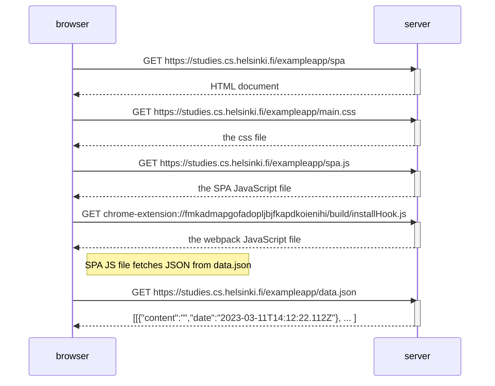

```mermaid
sequenceDiagram
  participant browser
  participant server
   browser->> server: GET https://studies.cs.helsinki.fi/exampleapp/spa
   activate server
    server-->>browser: HTML document
    deactivate server
      browser->>server: GET https://studies.cs.helsinki.fi/exampleapp/main.css
    activate server
    server-->>browser: the css file
    deactivate server
        browser->>server: GET https://studies.cs.helsinki.fi/exampleapp/spa.js
    activate server
    server-->>browser: the SPA JavaScript file
    deactivate server

    browser->>server: GET chrome-extension://fmkadmapgofadopljbjfkapdkoienihi/build/installHook.js

    activate server
    server-->>browser: the webpack JavaScript file
    deactivate server

    Note right of browser: SPA JS file fetches JSON from data.json


    browser->>server: GET https://studies.cs.helsinki.fi/exampleapp/data.json

    activate server
    server-->>browser: [[{"content":"","date":"2023-03-11T14:12:22.112Z"}, ... ]
    deactivate server


```
